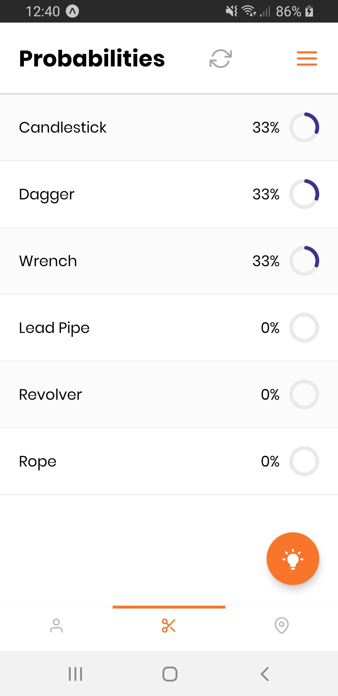
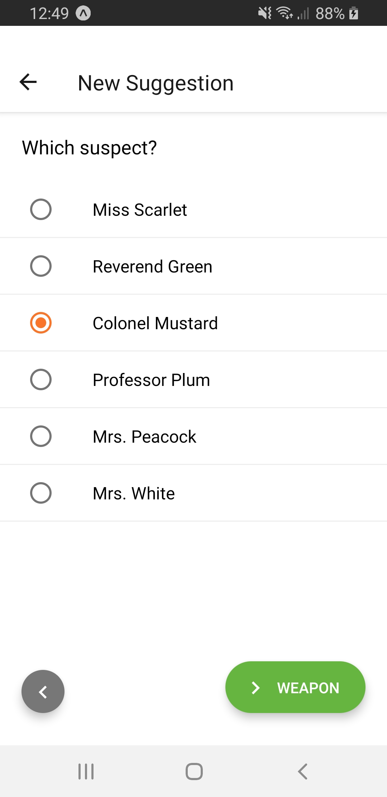
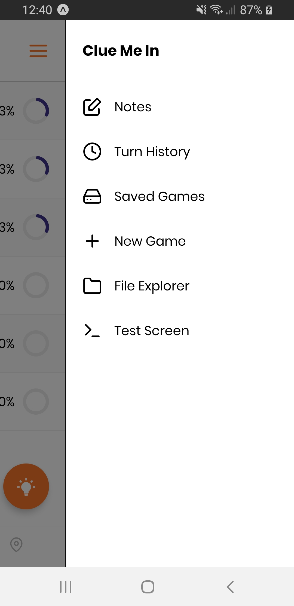

# Clue Me In #
*Note:* This app is still **in development**. It is currently not in a usable state. <br><br>
Clue Me In is a React Native mobile app that improves the user's chances of winning the boardgame [Clue](https://en.wikipedia.org/wiki/Cluedo). Its main feature is displaying the likelihood that each card in the game corresponds to the true circumstance of the murder. This feature allows the user to make better choices and ultimately conclude the circumstances of the murder faster than the opponents.

## Installation ##
1. Install [NodeJS](https://nodejs.org/en/)
2. Install [Expo CLI](https://docs.expo.io/versions/latest/workflow/expo-cli/)
```
npm install expo-cli --global
```
2. Clone the project
```
git clone https://github.com/eric-weischedel/clue.git
```
3. Install dependencies
```
cd clue
npm install
```
4. Serve the app using [Expo](http://expo.io/)
```
expo start
```
5. Run the app on your Android device/emulator or iOS simulator

## Features ##
- See the probability that each card is the correct one
- View a detailed history of the game's turns
- Take notes by typing them on a virtual notepad 
- Save your game for later and have multiple games going at once

## Screenshots ##




## Development Process ##

### Issue Tracking with Trello ###
Throughout the project I used a [Trello](https://trello.com) board to keep track of issues. I set up lists for *Backlog*, *In Progress*, and *Done*. I labeled each issue either *Design*, *Development*, *Algorithm*, or *Documentation*. This tool was useful for prioritizing and documenting tasks. You can look at my board [here](https://google.com).

### Design in Figma ###
After considering which features would make sense for the app, I used [Figma](https://figma.com)'s design tools to create wireframes for the app's screens. I decided that the *probability screen* should be the "main" screen since it is the primary feature of the app. Within this screen I needed to fit in all the cards and their probabilities. For ease of use, I separated the cards into three tabs based on their type (suspect, weapon, or room). The primary action of the app is adding a player's turn, so I overlayed a [Floating Action Button](https://callstack.github.io/react-native-paper/fab.html) on the main screen for this function. Since the notes, turn history, and game save/load are less used, they are slightly tucked away in a side [drawer menu](https://reactnavigation.org/docs/en/drawer-based-navigation.html).

### Development using React Native ###
Due to its high popularity I decided to create a React Native app using [Expo](https://expo.io/). Part of the reason for doing this project was to learn React Native. Before any coding I followed a great [video tutorial](https://www.youtube.com/playlist?list=PL4cUxeGkcC9ixPU-QkScoRBVxtPPzVjrQ) until I was comfortable with the basics.

#### Challenges I Overcame ####
- Setting up navigation
- Creating multi-screen forms for user input
- Implementing local storage read/write

### (*IN PROGRESS*) Probability Algorithm ###

#### Theorizing ####

#### Programming ####

## Future Plans ##
- Recommend which cards to suggest
- Recommend which rooms to head to
- Reveal deeper insights about the game

## Contact ##
You can reach me at yshuttle@gmail.com.
